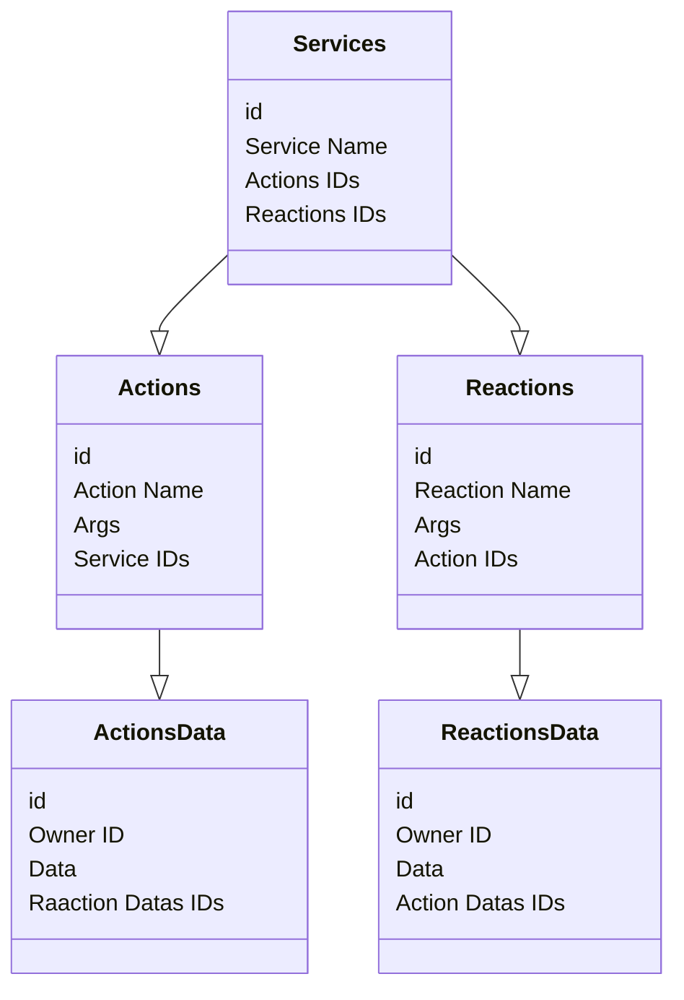

# AREA (Action Reaction)

As part of our third year, the AREA is an Epitech project included in the web development module.

## Table of Contents

- [Presentation](#presentation)
- [Installation](#installation)
- [Usage](#usage)
- [Database Diagram](#database-diagram)
- [Environment General](#environment-general)
- [Authors](#authors)
- [License](#license)
- [Acknowledgments](#acknowledgments)

## Presentation

- Project size: 5 people
- Project duration: 2 months
- Languages used: NodeJS, ReactJS, JS, SQL
- Frameworks used: Express, Sequelize, React, nextJS, Material UI, Tailwind CSS
- APIs used: Spotify, Twitch, Discord, Twitter, Github
- Compilation: docker-compose

## Installation
### Prerequisites

- docker
- docker-compose

### Installation

```bash
git clone https://github.com/BRAVMM/A-Rien.git
cd A-Rien
docker-compose up --build
```

## Usage

Access the application via the address: http://localhost:3000

Access the API via the address: http://localhost:8080

Access the mobile application via expo (auto search)

## Database Diagram



## Environment General

```mermaid
graph LR
A((Api)) --> C
A --> B
B[App mobile] --> D
C[App web] --> D{Data}

- **Romain Panno** - [Github](https://github.com/romainpanno)
- **Brice Desousa** - [Github](https://github.com/KitetsuK)
- **Macéo Jalbert** - [Github](https://github.com/Vivelis)
- **Vincent Balandi** - [Github](https://github.com/badidu09)
- **Mathéo Martin** - [Github](https://github.com/Beafowl-Pull)

## License

This project is licensed under the ``MIT`` license - see the [LICENSE.md](LICENSE.md) file for more details

## Acknowledgments

- [Epitech](https://www.epitech.eu/)
- [NodeJS](https://nodejs.org/en/)
- [ReactJS](https://fr.reactjs.org/)
- [NextJS](https://nextjs.org/)
- [Express](https://expressjs.com/fr/)
- [Sequelize](https://sequelize.org/)
- [Material UI](https://material-ui.com/)
- [Tailwind CSS](https://tailwindcss.com/)
- [Code Rabbit](https://github.com/apps/coderabbitai)
