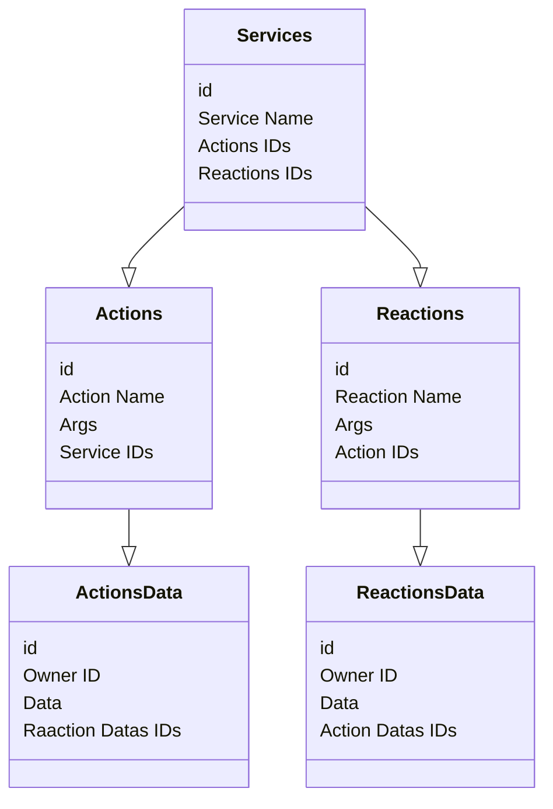
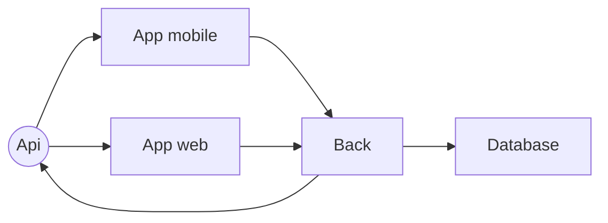

# AREA (Action Reaction)

As part of our third year, the **AREA** is an **Epitech** project included in the web development module.

## Table of Contents

- [AREA (Action Reaction)](#area-action-reaction)
  - [Table of Contents](#table-of-contents)
  - [Presentation](#presentation)
  - [Installation](#installation)
    - [Prerequisites](#prerequisites)
    - [Installing](#installing)
  - [Usage](#usage)
  - [Documentation](#documentation)
    - [New contributor](#new-contributor)
    - [New user](#new-user)
  - [Database Diagram](#database-diagram)
  - [Environment General](#environment-general)
  - [Authors](#authors)
  - [License](#license)
  - [Acknowledgments](#acknowledgments)

## Presentation

- **Project size:** 5 people
- **Project duration:** 2 months
- **Languages used:** NodeJS, ReactJS, JS, SQL
- **Frameworks used:** Express, Sequelize, React, nextJS, Material UI, Tailwind CSS
- **APIs used:** Spotify, Twitch, Discord, Twitter, Github
- **Compilation:** docker-compose

## Installation

### Prerequisites

- git
- docker
- docker-compose

### Installing

```bash
# Clone the project
git clone https://github.com/BRAVMM/A-Rien.git

# Go to the project root
cd A-Rien

# Run the project
docker-compose up --build
```

## Usage

Access the application via the address: [http://localhost:8081](http://localhost:8081).

Access the API via the address: [http://localhost:8080](http://localhost:8080).

Access the mobile application via expo, read the [official documentation](https://docs.expo.dev/get-started/expo-go/).

## Documentation

### New contributor

If you want to contribute to the project, you should start by reading the [developer documentation](docs/developer_documentation/index.md).

### New user

If you want to learn how to use the project, you should start by reading the [user documentation](docs/user_documentation/index.md).

## Database Diagram

> [!NOTE]  
> If the Mermaid diagram is not rendering on GitHub, you can view the static image here: [Database Diagram](docs/assets/database_diagram.png) or you see it in your editor using the mermaid extension.



## Environment General

> [!NOTE]  
> If the Mermaid diagram is not rendering on GitHub, you can view the static image here: [Env Diagram](docs/assets/env_diagram.png) or you see it in your editor using the mermaid extension.



## Authors

- **Romain Panno** - [Github](https://github.com/romainpanno)
- **Brice Desousa** - [Github](https://github.com/KitetsuK)
- **Macéo Jalbert** - [Github](https://github.com/Vivelis)
- **Vincent Balandi** - [Github](https://github.com/badidu09)
- **Mathéo Martin** - [Github](https://github.com/Beafowl-Pull)

## License

This project is licensed under the ``MIT`` license - see the [LICENSE.md](LICENSE.md) file for more details

## Acknowledgments

- [Epitech](https://www.epitech.eu/)
- [NodeJS](https://nodejs.org/en/)
- [ReactJS](https://fr.reactjs.org/)
- [NextJS](https://nextjs.org/)
- [Express](https://expressjs.com/fr/)
- [Sequelize](https://sequelize.org/)
- [Material UI](https://material-ui.com/)
- [Tailwind CSS](https://tailwindcss.com/)
- [Code Rabbit](https://github.com/apps/coderabbitai)
