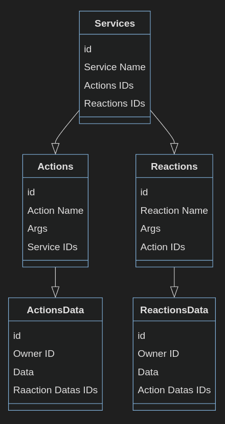

<!-- omit in toc -->
# Database documentation

<!-- omit in toc -->
## Table of contents

- [Introduction](#introduction)
- [Installation](#installation)
  - [Using Docker Compose](#using-docker-compose)
  - [Using Docker](#using-docker)
- [Database Diagram](#database-diagram)

## Introduction

The database is a PostgreSQL database.  
By default the database uses the port `5432`.  

## Installation

### Using Docker Compose

This is the easiest way to run the project.  
Go at the root of the project and run the following command:

```bash
docker-compose up --build
```

### Using Docker

First, you need to build the image:

```bash
docker build -t database .
```

Then, you can run the container:

```bash
docker run -d -p 5432:5432 database
```

## Database Diagram


