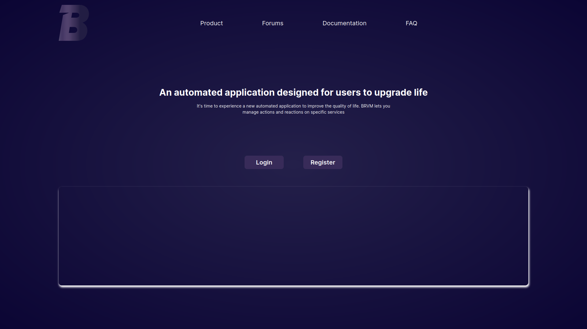
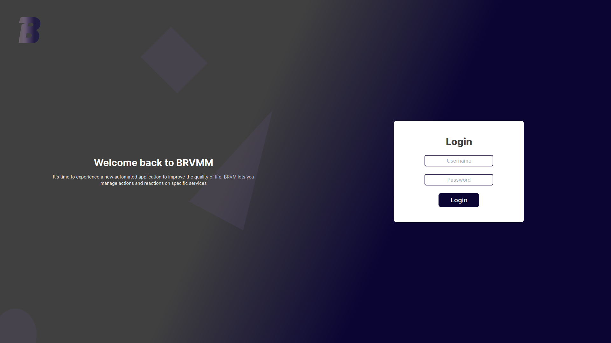
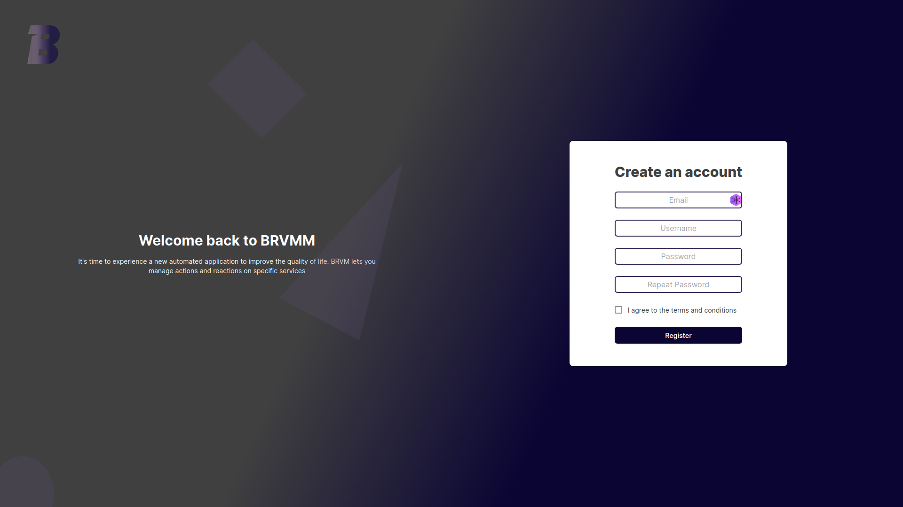
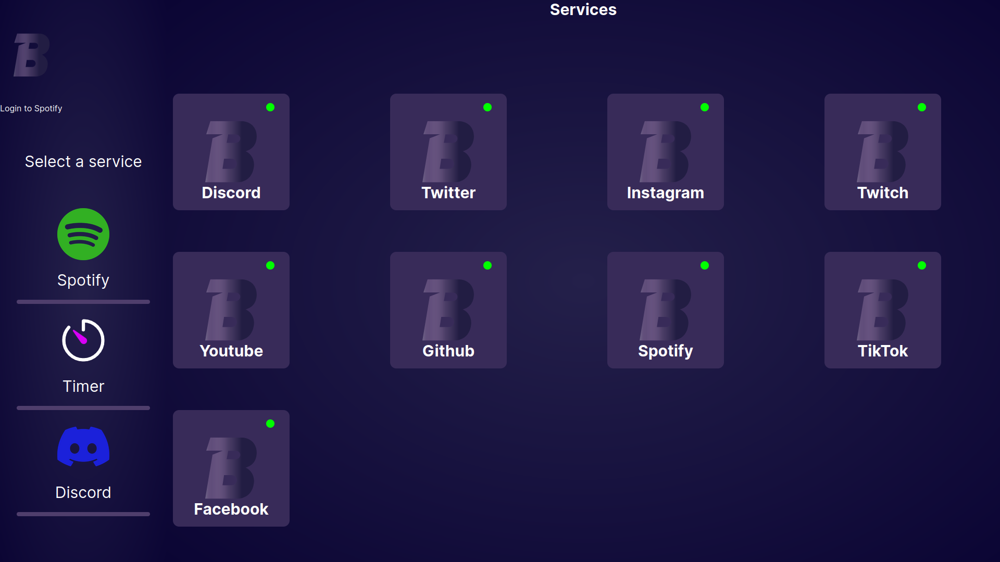

<!-- omit in toc -->
# Front documentation

<!-- omit in toc -->
## Table of contents

- [Introduction](#introduction)
- [Installation](#installation)
  - [Using Docker Compose](#using-docker-compose)
  - [Using Docker](#using-docker)
  - [Using Node.js](#using-nodejs)
- [Usage](#usage)
- [Sitemap](#sitemap)
  - [API Routes](#api-routes)
  - [Pages](#pages)
    - [Home page](#home-page)
    - [Login page](#login-page)
    - [Register page](#register-page)
    - [Services page](#services-page)
    - [Client apk](#client-apk)

## Introduction

The front is a web application using the [NextJs](https://nextjs.org/) framework.  
The front uses the [Tailwind CSS](https://tailwindcss.com/) framework to manage the styles.

## Installation

First, you need to define the environment variables.  
To do this, create a `.env.development` file in the `/front` directory.  
Then, fill in the following variables:

```bash
# .env.development

# Url of the back
NEXT_PUBLIC_API="http://127.0.0.1:8080"
```

### Using Docker Compose

This is the easiest way to run the project.  
Go at the root of the project and run the following command:

```bash
docker-compose up --build
```

### Using Docker

First, you need to build the image:

```bash
docker build -t front .
```

Then, you can run the container:

```bash
docker run -d -p 3000:8081 front
```

### Using Node.js

First, you need to install the dependencies:

```bash
npm install
```

Then, you can run the project:

```bash
npm run dev
```

## Usage

You can access the front at the following url: [http://localhost:8081](http://localhost:8081)

## Sitemap

### API Routes

| Method | Route       | Description             |
| ------ | ----------- | ----------------------- |
| GET    | /           | Home page               |
| GET    | /login      | Login page              |
| GET    | /register   | Register page           |
| GET    | /services   | Services page           |
| GET    | /client.apk | Download the client apk |

### Pages

#### Home page

The home page is the main page of the front.
It allows you to access the login and registration pages.



#### Login page

The login page allows you to log in to the application.



#### Register page

The register page allows you to register in the application.



#### Services page

The services page allows you to manage your services.



#### Client apk

The client apk allows you to download the client apk.  
It will allow you to use the application on your smartphone.
