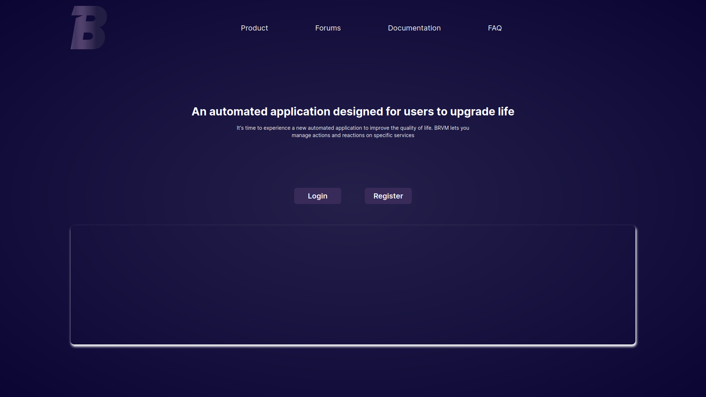
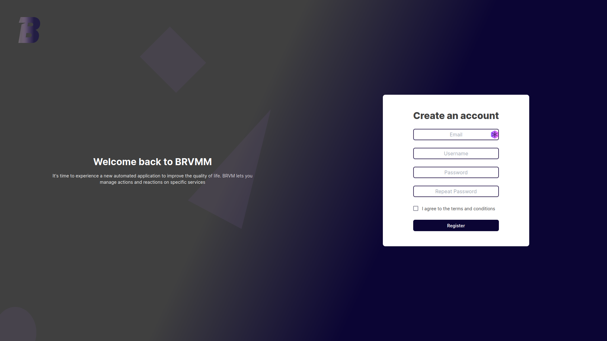

<!-- omit in toc -->
# User documentation

Welcome to the user documentation of the A-RIEN project.  
This documentation is intended for users who want to use the project.

<!-- omit in toc -->
## Table of contents

- [Presentation of the project](#presentation-of-the-project)
- [Getting started](#getting-started)
  - [Home page](#home-page)
  - [User creation](#user-creation)
  - [Login](#login)
  - [Connect a service](#connect-a-service)
  - [Create an automation](#create-an-automation)

## Presentation of the project

The **A-RIEN** project is an automation project.  
It allows you to automate your daily tasks by associating some actions to some reactions.  
For example, you can configure the project to send you an email when it rains.  

## Getting started

### Home page

The home page is the main page of the project.  
It allows you to access the login and registration pages.  

1. Go to the [home page](http://localhost:8081)
2. Click on the "Register" button to access the registration page
3. Click on the "Login" button to access the login page

### User creation

To use the project, you must first create an account.

1. Go to the [registration page](http://localhost:8081/register)
2. Fill in the form
3. Click on the "Register" button

### Login

To log in to the project, you must first have created an account (see [User creation](#user-creation)).
Then, you can log in to the project.

1. Go to the [login page](http://localhost:8081/login)
2. Fill in the form
3. Click on the "Login" button

### Connect a service

### Create an automation

1. Go to the [services page](http://localhost:8081/services)
2. Connect to a service by clicking on the login button corresponding to the service that you want on top of the **select a service** section at the left of the page
3. Click on the "Create an automation" button corresponding to the service that you want in the **select a service** section at the left of the page
  
4. Click on the action that you want show in the service modal that appears

5. Fill in the form

6. Fill in the form

7. Fill in the form

8. Fill in the form

